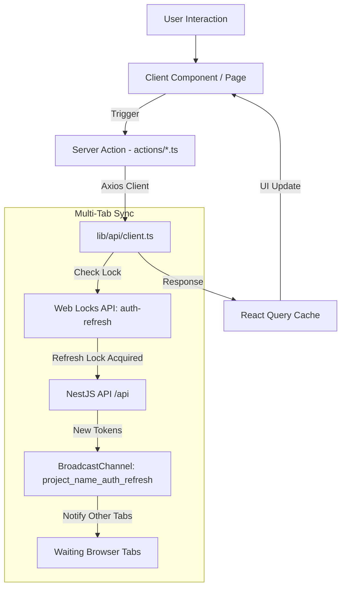

# 🎨 Front-End (Next.js 16 Client)

> **Modern, high-performance Web Application client for the IAM platform built with Next.js 16 (App Router & Turbopack), React 19, Bun, Tailwind CSS v4, and TanStack React Query v5.**

---

## 📌 Table of Contents

- [Overview](#-overview)
- [Key Technical Features](#-key-technical-features)
- [Design Aesthetic](#-design-aesthetic)
- [Data Flow & Concurrency Architecture](#-data-flow--concurrency-architecture)
- [Tech Stack](#-tech-stack)
- [Getting Started](#-getting-started)
- [Project Structure](#-project-structure)
- [Page & Route Hierarchy](#-page--route-hierarchy)
- [Available Scripts](#-available-scripts)
- [License](#-license)

---

## 🚀 Overview

The **Front-End Application** is a standalone, single-page application style Next.js client built for high security, multi-tab session synchronization, and an editorial user experience. It communicates seamlessly with the NestJS REST API using Next.js Server Actions (`next-safe-action`), Axios, and TanStack React Query.

---

## 💡 Key Technical Features

### 1. Multi-Tab Concurrency Control & Web Locks
- **Web Locks API (`navigator.locks.request('auth-refresh')`):** Prevents token refresh race conditions when a user opens multiple browser tabs simultaneously. Only one tab executes `POST /api/auth/refresh` while waiting tabs reuse the newly issued access token.
- **BroadcastChannel API (`project_name_auth_refresh` & `project_name_auth_revocation`):** Broadcasts token refresh and session revocation events across all active browser windows in real time.

### 2. End-to-End Type Safety & Data Fetching
- **Server Actions with `next-safe-action`:** All API requests are processed through validated server actions using Zod schemas.
- **TanStack React Query v5:** Powers client-side caching, optimistic updates, automatic refetching, and query cache invalidation.

### 3. Complete Admin Control Panel
- **Users Management:** Paginated user tables with debounced search, role/status filtering, and sorting.
- **User Detail & Ban History:** Detailed profile view featuring active/expired sessions and complete ban history tables.
- **Admin Audit Logs:** Action-filtered table tracking administrative activities with an interactive JSON inspection modal.

### 4. Robust Auth & Profile Flows
- Email/Password sign-up with email verification cooldown timers.
- Google OAuth 2.0 flow with callback handling and error toasts.
- Tabbed profile management dialog (Profile, Security, Active Sessions, Linked OAuth accounts) with URL state synchronization (`?open=`).
- Automated redirect guards for banned users (`BannedGuard`) and admin role protection (`AdminGuard`).

---

## 🎨 Design Aesthetic

The application features a **Warm Editorial Aesthetic** inspired by print newspapers and financial dashboards:

- **Headlines:** Serif typography using **DM Serif Display** & **DM Serif Text**.
- **Metadata & Badges:** Monospace typography using **IBM Plex Mono** (always uppercase with wide tracking).
- **Sharp Geometry:** No rounded corners (`rounded-none` is enforced on cards, dialogs, inputs, and buttons).
- **Border-Based Depth:** No box shadows; visual hierarchy is created strictly using border weights.
- **Color Palette:** Warm cream (light mode) / near-black (dark mode) paired with terracotta accent tones (`#c14a2b` / `#e05a3a`).

---

## 🔄 Data Flow & Concurrency Architecture



---

## 🛠️ Tech Stack

| Property | Technology |
|---|---|
| **Framework** | Next.js v16.3.0 (App Router, Turbopack) |
| **Library** | React v19.2.4 |
| **Language** | TypeScript v5 |
| **Package Manager / Runtime** | Bun |
| **Styling** | Tailwind CSS v4 (`@tailwindcss/postcss`) |
| **Components** | Radix UI primitives |
| **Icons** | Lucide React |
| **State & Caching** | TanStack React Query v5 |
| **Form Management** | React Hook Form v7 + Zod v4 |
| **Server Actions** | `next-safe-action` v8.5.3 |
| **HTTP Client** | Axios v1.19.0 |
| **Theme** | `next-themes` (Dark/Light mode) |
| **Notifications** | Sonner |

---

## 🚀 Getting Started

### Prerequisites

- **Bun**: `v1.1+`

### 1. Environment Setup

Create `.env.local` in the `front-end` directory:

```env
NEXT_PUBLIC_APP_URL="http://localhost:3000"
NEXT_PUBLIC_API_URL="http://localhost:5000/api"
NEXT_PUBLIC_SUPPORT_EMAIL="support@example.com"
```

### 2. Install Dependencies

```bash
bun install
```

### 3. Run Development Server

```bash
bun run dev --turbo
```

Open [http://localhost:3000](http://localhost:3000) in your browser.

---

## 📂 Project Structure

```
front-end/
├── actions/                            # Next.js Server Actions (admin, auth, profile)
├── app/                                # Next.js App Router
│   ├── (admin)/                        # Admin layout & pages (/admin/users, /admin/audit-logs)
│   ├── (auth)/                         # Auth pages (/login, /register, /forgot-password, /verify, /banned)
│   ├── (root)/                         # User dashboard (/dashboard)
│   ├── oauth/callback/                 # Google OAuth callback route
│   ├── globals.css                     # Tailwind CSS & theme tokens
│   └── layout.tsx                      # Root layout & providers
├── components/                         # React UI components
│   ├── admin/                          # Users table, Audit logs, Ban history, Filters
│   ├── auth/                           # Guards & revocation listeners
│   ├── profile/                        # Profile dialog & tabbed panels
│   └── ui/                             # Radix UI styled primitives
├── hooks/                              # Custom React hooks (URL state, session, timers)
├── lib/                                # Core utilities
│   ├── api/client.ts                   # Axios client with Web Locks API & cookie forwarding
│   ├── auth/revocation.ts              # BroadcastChannel revocation emitter
│   └── zodSchema/                      # Zod validation schemas
├── providers/                          # QueryProvider & ThemeProvider
└── constants/                          # Route constants
```

---

## 🗺️ Page & Route Hierarchy

| Path | Layout | Protection | Role | Description |
|---|---|---|---|---|
| `/` | Root | Optional | Any | Home page (auto-redirects based on auth status) |
| `/login` | `(auth)` | Guest | Any | Sign-in page (Email/Password & Google OAuth) |
| `/register` | `(auth)` | Guest | Any | User registration page |
| `/forgot-password` | `(auth)` | Guest | Any | Password reset request |
| `/reset-password` | `(auth)` | Guest | Any | Password reset confirmation with token |
| `/verify` | `(auth)` | Guest | Any | Email verification confirmation |
| `/dashboard` | `(root)` | Auth | User/Admin | User dashboard & profile management trigger |
| `/admin/users` | `(admin)` | Auth | Admin | Admin user management (search, filter, ban/unban, role) |
| `/admin/users/:id` | `(admin)` | Auth | Admin | Detailed user profile, ban history & active sessions |
| `/admin/audit-logs` | `(admin)` | Auth | Admin | Paginated audit log tracking with JSON inspection |
| `/banned` | `(auth)` | Banned | Any | Banned user notification & support contact page |

---

## 📜 Available Scripts

```bash
# Run development server with Turbopack
bun run dev --turbo

# Build application for production
bun run build

# Start production server
bun run start

# Run ESLint check
bun run lint
```

---

## 📄 License

This project is licensed under the MIT License.
